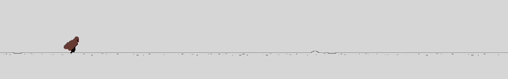
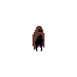
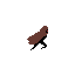
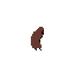
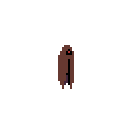
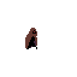
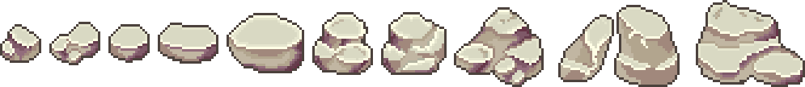
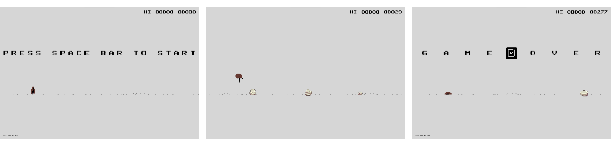

# Unity - 2D - Endless Runner

## 🔖 Table of contents

<details>
        <summary>
		CLICK TO ENLARGE 😇
        </summary>
	    📝 <a href="#description">Description</a>
        <br>
        🔨 <a href="#tech-stack">Tech stack</a>
        <br>
        📂 <a href="#files-description">Files description</a>
        <br>
        📌 <a href="#assets">Assets<a>
        <br>
        💻 <a href="#installation">Installation</a>
        <br>
        🔧 <a href="#whats-next">What's next ?</a>
        <br>
        ♥️ <a href="#thanks">Thanks</a>
        <br>
        👷 <a href="#authors">Authors</a>
</details>

## 📝 <span id="description">Description</span>

### Project Overview:
This project aims to recreate the gameplay of Google Chrome's Dino T-Rex game using Unity, focusing on fundamental game development concepts such as player control, collision management, and dynamic procedural level generation. Leveraging insights from various video tutorials and incorporating royalty-free asset packs, I have added my personal touch to the code, introducing enhanced functionalities

### Objective and scope:
The primary goal is educational, serving as an exercise to grasp essential game development principles. The secondary objective involves mastering Git and GitHub within the Unity environment, laying the groundwork for future, more complex projects. This experience has been valuable for honing version control skills, ensuring a robust foundation for efficient collaboration and project management in subsequent endeavors.

### Non-Profit and learning emphasis:
It's important to note that this project is entirely non-profit and undertaken purely as a learning exercise. The code is intentionally over-commented to aid understanding, reflecting my commitment to detailed explanations for educational purposes. While functional, the code requires further improvement and optimization, presenting an excellent opportunity for ongoing learning and refinement.



## 🔨 <span id="tech-stack">Tech stack</span>

<p align="left">


    
</p>

## 📂 <span id="files-description">Files description</span>

| FILE               | DESCRIPTION                                                                                               |
| :----------------: | --------------------------------------------------------------------------------------------------------- |
| Assets             | Contains project assets like 2D sprites, scripts, sounds, textures etc.                                   |
| Packages           | May include Unity packages with pre-built code and resources for specific functionalities.                |
| ProjectSettings    | Stores project-specific configuration files (import settings, platform settings, quality settings, etc.). |
| resources          | Contains additional materials for the README file.                                                        |
| .gitignore         | Specifies files and folders to be ignored by Git version control.                                         |
| Endless Runner.zip | Contains game executable for testing purpose.                                                             |
| README.md          | The README file you are currently reading ;).                                                             |

## 📌 <span id="assets">Assets</span>

<p align="center">
    
    
    
    
    
    <br><br>
    <a href="https://pixramen.itch.io/2d-action-platformer-sci-fi-vagabond">2D action platformer sci-fi character - Vagabond by Pixramen</a>
    <br><br>
    
    <br><br>
    <a href="https://verzatiledev.itch.io/rocks">A bunch of rocks by VerzatileDev</a>
</p>

## 💻 <span id="installation">Installation</span>

### Clone the repository and run from Unity

1. Clone the repository:
    - Open your preferred terminal.
    - Navigate to the directory where you want to clone the repository.
    - Run the following command:
```
git clone https://github.com/fchavonet/unity-2d-endless-runner.git
```

2. Open in Unity:
    - Launch Unity Hub.
    - Click on "Add" and select the folder where you cloned the repository.
    - Once added, click on the project to open it in Unity.

3. Run from Unity:
    - In the Unity Editor, navigate to the "Assets" folder.
    - Open the "Scenes" folder.
    - Double-click on the "Main Scene" to open it.
    - Click the "Play" button at the top to run the game in the Unity Editor.

### Download and run the executable

1. Download the game:
    - Go to the project's GitHub repository: Unity 2D Endless Runner.
    - Click on the green "Code" button, then select "Download ZIP."
    - Extract the contents of the downloaded ZIP file to your desired location.

2. Run the game:
    - Navigate to the extracted folder.
    - Find and run the "Endless Runner.exe" executable file.

<br>
*Note: ensure that you have the necessary system requirements to run Unity games on your machine.*

### How to play

- Jump: `spacebar`.
- Restart: `r` when game over.
- Quit: `esc`.

<p align="center">

</p>

## 🔧 <span id="whats-next">What's next ?</span>

- Enhance the jumping system for increased dynamism.
- Integrate a parallax scrolling system (with new background ?).
- Introduce new types of obstacles.
- Clean and optimize code.

## ♥️ <span id="thanks">Thanks</span>

A big thank you to my friend Yoann for taking time out of his busy schedule to test this little game.

## 👷 <span id="authors">Authors</span>

**Fabien CHAVONET**
- Github: [@fchavonet](https://github.com/fchavonet)
